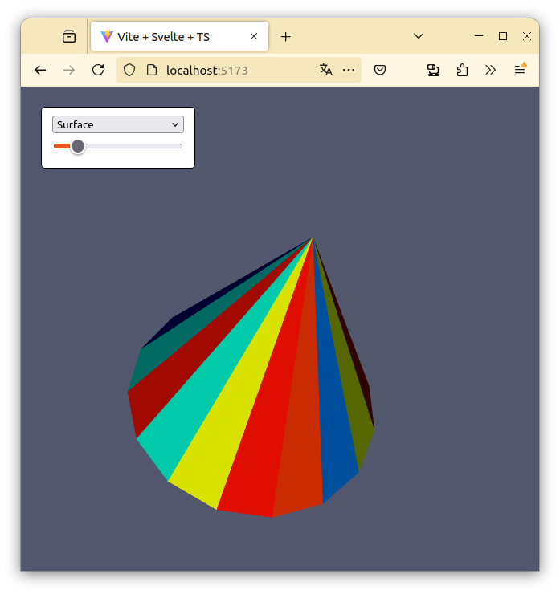

# Readme

This are the instructions followed in order to make this repo. 

## Start the Svelte repo

First, I created the project directory structure following the [template provided in the Vite site](https://vite.dev/guide/). Mind that although `vtkjs` uses webpack as a bundler, Svelte uses vite by default.

```bash
npm create vite@latest my-svelte-app -- --template svelte-ts
```

Then follow the instructions and run the following commands. They get you inside the directory, install all the package dependencies, and run the development server. 

```bash
cd my-svelte-app
npm install
npm run dev
```

You should see a simple _Vite + Svelte_ template. Nothing fancy yet.

## Get the `vtkjs` code in

Now, the juicy part. We're here to see the `vtkjs` example. We start with the cone example as that's the easiest one of them.

Go to [Starting a vtk.js project from scratch](https://kitware.github.io/vtk-js/docs/vtk_vanilla.html) and copy the code you find there (the one listed at `src/index.js`). Paste it on your `App.svelte` file on the `<script>` tag at the top. And it should pretty much work.

You can also delete stuff that we don't use like the initial `import` statements at the `<script>` tag, or the contents of the `<main>` and `<style>` tags.

If you had the development server running, you should see the cone on the browser. If it wasn't running, run in doing

```bash
npm run dev
```